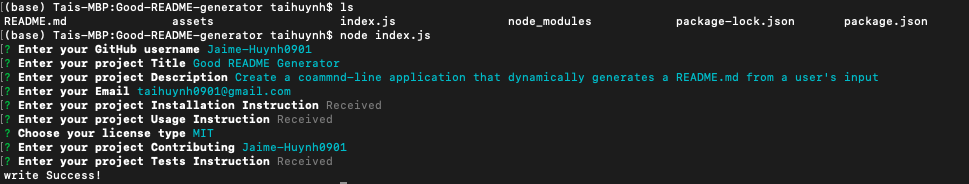

# Good README Generator                                                                                                     

## Project Desscription:

Create a coammnd-line application that dynamically generates a README.md from a user's input

## Table of Contents:

* [Installation](#Installation-Instruction)

* [Usage](#Usage)

* [License](#License)

* [Contributing](#Contributing)

* [Test Instruction](#Test-Instruction)

* [Question](#Question)

## Installation Instruction:

1. git clone the repo to your local machine. 
2. install the dependency using: `npm install -s`

## Usage:

1. cd to the directory of the application folder. 
2. run `node index.js` 
3. Enter the prompted question(command line).
    - Installation, Usage and Test question: It will open your text editor for you to enter the anwser (long anwser).

## License:

MIT

## Contributing:

Jaime-Huynh0901

## Test Instruction:

* GIVEN a command-line application that accepts user input
    1. WHEN I am prompted for information about my application repository
        - THEN a quality, professional README.md is generated with the title of your project and sections entitled Description, Table of Contents, Installation, Usage, License, Contributing, Tests, and Questions
    2. WHEN I enter my project title
        - THEN this is displayed as the title of the README
    3. WHEN I enter a description, installation instructions, usage information, contribution guidelines, and test instructions
        - THEN this information is added to the sections of the README entitled Description, Installation, Usage, Contributing, and Tests
    4. WHEN I choose a license for my application from a list of options
        - THEN a badge for that license is added hear the top of the README and a notice is added to the section of the README entitled License that explains which license the application is covered under
    5. WHEN I enter my GitHub username
        - THEN this is added to the section of the README entitled Questions, with a link to my GitHub profile
    6. WHEN I enter my email address
        - THEN this is added to the section of the README entitled Questions, with instructions on how to reach me with additional questions
    7. WHEN I click on the links in the Table of Contents
        - THEN I am taken to the corresponding section of the README

* [Video Demo Link](https://drive.google.com/file/d/1x3QDfczq6nuzC-en7stzaYjDKfMzVi-E/view)
* 

## Question:

if you have any question, Feel free to reach out to me at:

##### Git UserName: Jaime-Huynh0901  
##### Git profile: https://github.com/Jaime-Huynh0901
##### Email Address: taihuynh0901@gmail.com
